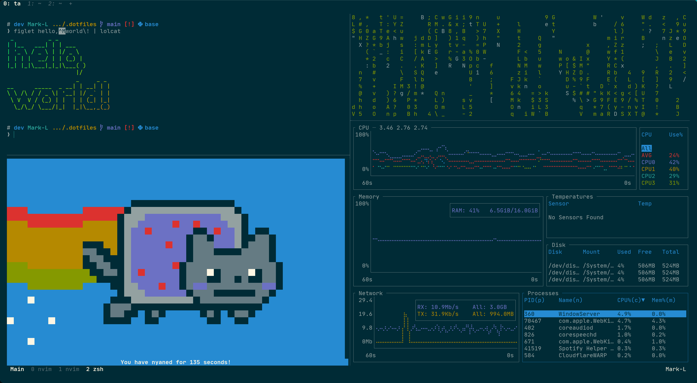

# dotfiles


This repo currently only contains dotfiles for Mac setup, may update for other OS, e.g. ArchLinux,
in the future.

- [CLI Tools](#cli-tools)
- [System Info](#system-info)
- [Dotfiles](#dotfiles-1)
- [Terminal](#terminal)
  - [WezTerm](#wezterm)
  - [Oh My Zsh](#oh-my-zsh)
  - [Tmux](#tmux)
- [Programming Languages](#programming-languages)
  - [Rust](#rust)
  - [Python](#python)
  - [NodeJS](#nodejs)
  - [Solidity](#solidity)
- [NeoVim](#neovim)
- [Mac UI/UX](#mac-uiux)
- [TODO](#todo)

## CLI

### Setup

Install `Xcode Command Line Tools` and [`Homebrew`](https://brew.sh).

```bash
xcode-select --install
/bin/bash -c "$(curl -fsSL https://raw.githubusercontent.com/Homebrew/install/HEAD/install.sh)"
```

### CLI Tools

```bash
brew install asciinema gh glow jq tmux
brew install cmatrix figlet lolcat nyancat  # just for fun!
figlet hello, world\! | lolcat
```

More CLI tools can be found in the [Rust section](#more-cli-tools-in-rust).

### System Info

```bash
brew install neofetch
neofetch
```


## Dotfiles

Clone this repo and use `stow` to link the config files to their respective locations.

```bash
brew isntall stow
git clone https://github.com/0xYYY/dotfiles .dotfiles
cd .dotfiles && stow $(ls -d \*/) && cd ~
```

## Terminal

### WezTerm

My terminal of choice is [WezTerm](https://wezfurlong.org/wezterm/), for it's rich features, ease of
configuration, and support for tabs and ligature (which
[Alacritty](https://github.com/alacritty/alacritty/issues/50) lacks).

```bash
brew tap wez/wezterm
brew install --cask wez/wezterm/wezterm
brew tap homebrew/cask-fonts
brew install font-jetbrains-mono-nerd-font codicon
```

### Oh My Zsh

```bash
sh -c "$(curl -fsSL https://raw.githubusercontent.com/ohmyzsh/ohmyzsh/master/tools/install.sh)" "" \
    --unattended
mv .zshrc.pre-oh-my-zsh .zshrc
git clone https://github.com/zsh-users/zsh-completions \
    ${ZSH_CUSTOM:-${ZSH:-~/.oh-my-zsh}/custom}/plugins/zsh-completions
git clone https://github.com/jeffreytse/zsh-vi-mode \
    ${ZSH_CUSTOM:-${ZSH:-~/.oh-my-zsh}/custom}/plugins/zsh-vi-mode
```

### Tmux

```bash
git clone https://github.com/tmux-plugins/tpm $HOME/.tmux/plugins/tpm
bash $HOME/.tmux/plugins/tpm/scripts/install_plugins.sh
```



## Programming Languages

### Rust

Install Rust and [`sccache`](https://github.com/mozilla/sccache) for faster compilation.

```bash
curl --proto '=https' --tlsv1.2 -sSf https://sh.rustup.rs | bash -s -- --verbose -y --no-modify-path
rustup component add rust-src
rustup toolchain install nightly
cargo install sccache
```

#### More CLI Tools in Rust

I like to explore CLI tools implemented in Rust, since

1. they are often faster and more user-friendly after the re-implementation, and
2. I would like to contribute to open-source Rust projects, and these tools give me a lot of great
   starting points.

```bash
cargo install atuin bat bottom choose dua-cli exa fd-find git-delta gitui heh hexyl huniq jless \
    jql just macchina procs pueue ripgrep rm-improved rnr sd skim starship tokei tuc volta \
    watchexec-cli xcp xh xsv zoxide
```

### Python

Install Python and [Mamba](https://mamba.readthedocs.io/en/latest/index.html) for package
management.

```bash
curl -Ls https://micro.mamba.pm/api/micromamba/osx-arm64/latest | tar -xvj bin/micromamba
mv bin/micromamba $HOME/.local
mamba install -n base python=3.10 ipython --yes
```

### NodeJS

Install NodeJS and [Volta](https://volta.sh) for tool management.

```bash
curl https://get.volta.sh | bash -s -- --skip-setup
volta install node
volta install yarn
```

### Solidity

Install Solidity and [solc-select](https://github.com/crytic/solc-select) for version management.

```bash
pip install solc-select
solc-select install $(solc-select install | tail -1)
curl -L https://foundry.paradigm.xyz | bash
foundryup
```

## NeoVim

### Setup

I'm using the nightly version of NeoVim (for `winbar` support, requires `neovim >= 0.8`) and
[`packer`](https://github.com/wbthomason/packer.nvim) for plugin management.

```bash
brew install --HEAD neovim
mamba install pynvim
yarn install neovim
git clone --depth 1 https://github.com/wbthomason/packer.nvim \
 .local/share/nvim/site/pack/packer/start/packer.nvim
nvim --headless -u .config/nvim/packer_install.lua > /dev/null 2>&1
```

### LSP Tools

```bash
brew install rust-analyzer shellcheck shfmt stylua
yarn global add prettier prettier-plugin-solidity typescript typescript-language-server
mamba install black
```

### Plugins

The list of plugins can be found [here](neovim/.config/nvim/lua/settings/plugins.lua).


## Mac UI/UX

Not actually part of the dotfiles, but useful applications for improving Mac UI/UX.

- [AltTab](https://alt-tab-macos.netlify.app)
- [BetterDisplay](https://github.com/waydabber/BetterDisplay#readme)
- [Rectengle](https://rectangleapp.com)

## TODO

- [ ] NeoVim LSP configs for
  - [ ] Python
  - [ ] TypeScript
  - [ ] Solidity
